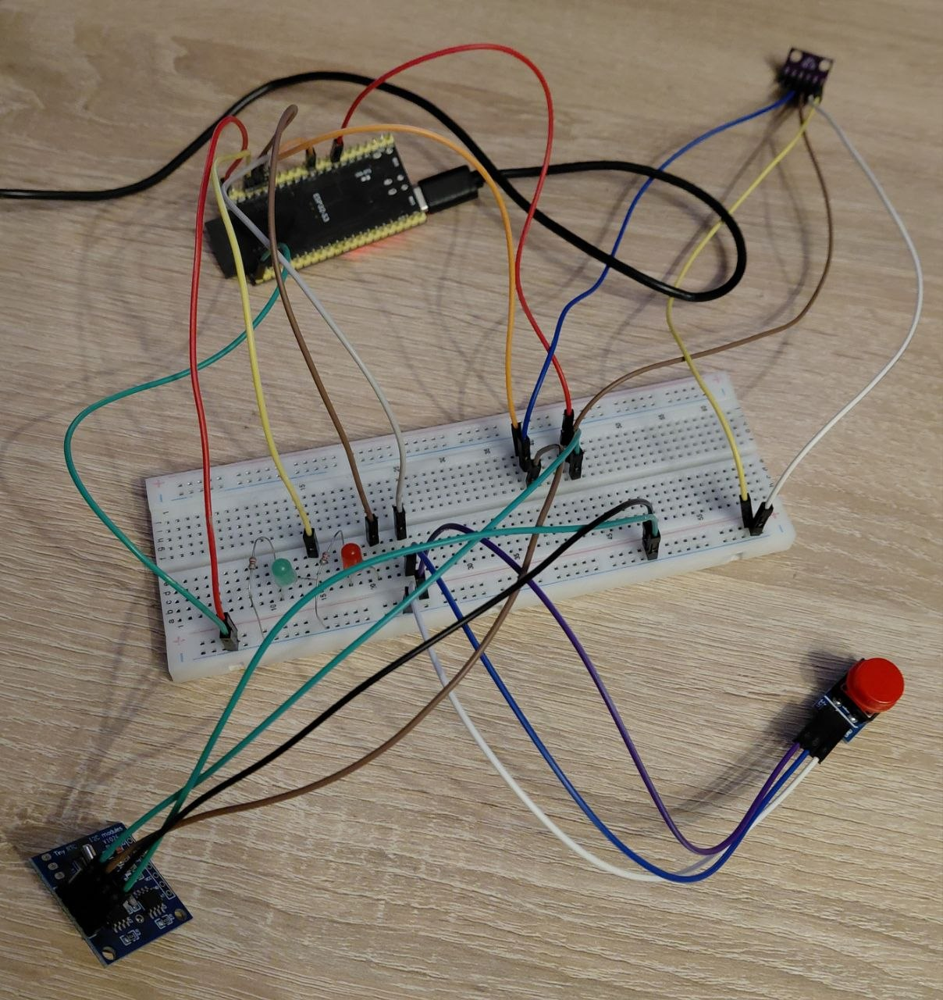
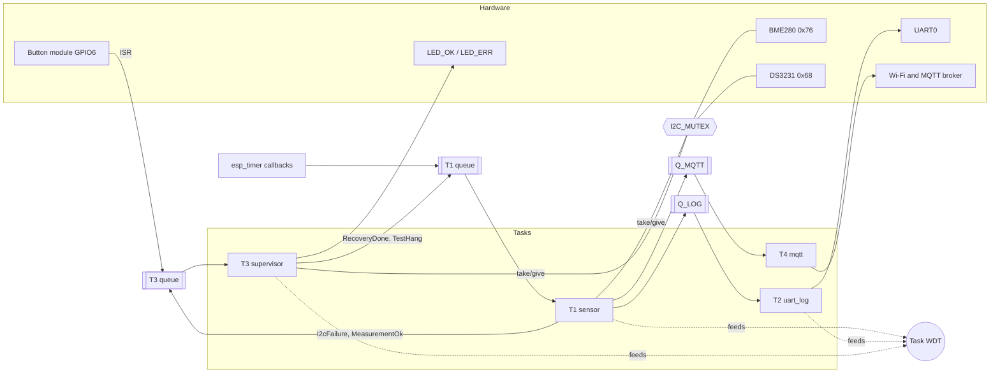
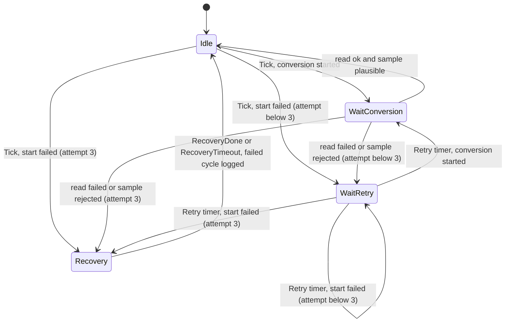
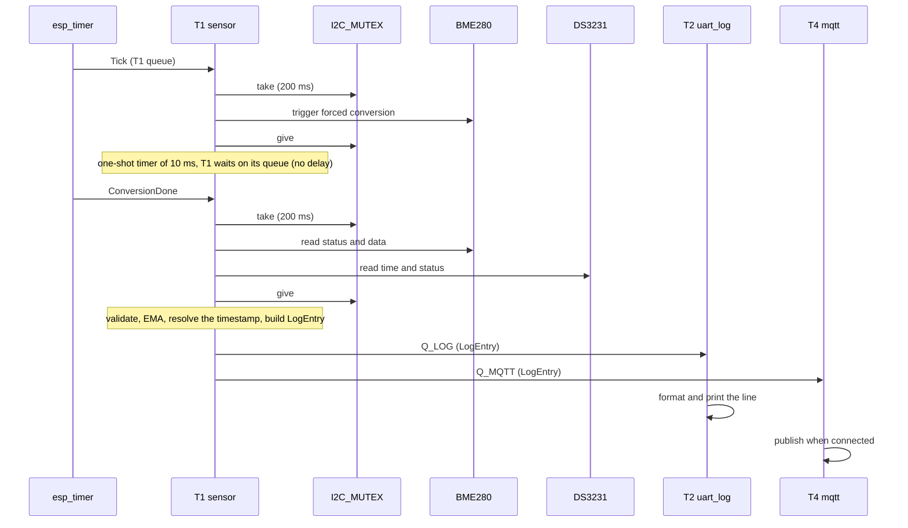
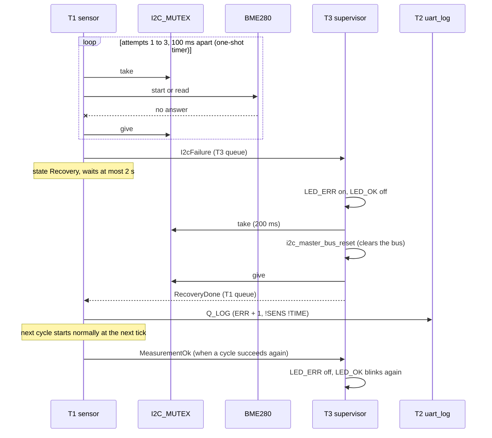

# Environment Logger

An autonomous ESP32-S3 telemetry logger: it reads temperature, humidity and pressure from a BME280 every 5 seconds, stamps each reading with a DS3231 real-time clock, prints a formatted line over UART, publishes the values over MQTT, and keeps running when the I2C bus misbehaves or a task hangs.

```
[14:18:54] T:24.3 H:40% P:983 ERR:0
```

> Author: **Yurii Kazan** · Course final project, Embedded Development · Firmware: C++ on ESP-IDF 5.5.3 + FreeRTOS



## Table of contents

1. [Project description](#1-project-description)
2. [Features](#2-features)
3. [Hardware and wiring](#3-hardware-and-wiring)
4. [Why these components](#4-why-these-components)
5. [Architecture](#5-architecture)
6. [Interfaces](#6-interfaces)
7. [Log format](#7-log-format)
8. [MQTT telemetry](#8-mqtt-telemetry)
9. [Error strategy](#9-error-strategy)
10. [How to build and run](#10-how-to-build-and-run)
11. [Results](#11-results)
12. [Testing](#12-testing)
13. [Known issues and limitations](#13-known-issues-and-limitations)
14. [What I would improve](#14-what-i-would-improve)
15. [Self-check against the checklist](#15-self-check-against-the-checklist)
16. [Technology stack, credits and license](#16-technology-stack-credits-and-license)

## 1. Project description

**Problem.** A logger that sits unattended must keep producing trustworthy data. The usual failure modes are quiet ones: a loose wire makes the I2C bus hang, a task deadlocks, the clock battery dies and every record is stamped `2000-01-01`. A logger that stops without telling anyone is worse than no logger.

**Solution.** The firmware is split into independent FreeRTOS tasks (sensor, UART output, supervisor, MQTT). The measurement is an event-driven state machine with bounded retries, every wait has a timeout, the I2C bus is protected by one mutex, and a task watchdog resets the chip if a task stops running. After a reset the firmware reports why it restarted.

**Use cases.** Room or lab climate logging, a data source for a dashboard, and a small reference for building recoverable I2C firmware on ESP-IDF.

## 2. Features

- BME280 readings (temperature, humidity, pressure) every 5 s, filtered with an EMA (`alpha` = 0.2).
- Timestamps from a DS3231 RTC; an invalid RTC (dead battery, default date) is detected and the entry is marked `!TIME`.
- Formatted log line over UART0 at 115200 baud, written by a single task.
- Best-effort MQTT publishing over Wi-Fi to a public broker; the logger works without a network.
- I2C error handling: three attempts 100 ms apart, then a bus reset requested from the supervisor, then the next cycle starts normally.
- Task watchdog (10 s, resets the chip) on the three tasks that keep the logger alive; the reset reason is logged at boot.
- No `delay()`, no `vTaskDelay()`, no busy-wait: pauses are states of a state machine, ended by events or one-shot timers.
- Two LEDs (OK heartbeat, error) and a button (short press clears the error counter, long press demonstrates the watchdog).
- A diagnostics task that periodically reports heap, CPU load and per-task stack use.
- Unit tests for the pure logic, run on the PC.

## 3. Hardware and wiring

Board: ESP32-S3-DevKitM-1, powered over USB.

| Part | Role | Interface | Address / pin |
|---|---|---|---|
| BME280 module | Temperature, humidity, pressure | I2C | `0x76` |
| DS3231 module (with LIR2032) | Real-time clock | I2C, same bus | `0x68` (its EEPROM answers at `0x50`, unused) |
| LED_OK + 220 Ω | Heartbeat: T3 is alive | GPIO out | GPIO4 |
| LED_ERR + 220 Ω | Error / recovery in progress | GPIO out | GPIO5 |
| Button module (3 pins) | Operator input | GPIO in + interrupt | GPIO6, pressed = high |
| UART0 | Log output | UART | TX GPIO43, RX GPIO44, 115200 8N1 |

I2C: SDA = GPIO8, SCL = GPIO9, 400 kHz. The pull-ups are on the modules (BME280 10 kΩ, DS3231 4.7 kΩ per line, about 3.2 kΩ in parallel), so no external resistors are used.

```
ESP32-S3                BME280 (0x76)         DS3231 (0x68)
3V3  ------------------ VCC ----------------- VCC
GND  ------------------ GND ----------------- GND
GPIO8 (SDA) ------------ SDA ----------------- SDA
GPIO9 (SCL) ------------ SCL ----------------- SCL

GPIO4 --[220R]--|>|-- GND   (LED_OK)
GPIO5 --[220R]--|>|-- GND   (LED_ERR)
GPIO6 ------------------ OUT  (button module: VCC to 3V3, GND to GND, pressed = high)
```

Schematic: [`docs/schematic/schematic.png`](docs/schematic/schematic.png) ([PDF](docs/schematic/schematic.pdf)), KiCad sources in [`hardware/kicad/`](hardware/kicad/). More wiring notes: [`docs/hardware.md`](docs/hardware.md).

Notes:

- The DS3231 module has a battery charging circuit, so it is fitted with a rechargeable LIR2032; a plain CR2032 should not be used with it.
- Wi-Fi: the ESP32-S3 supports **2.4 GHz networks only**.

## 4. Why these components

Each element answers one need of the project; nothing was added only to tick a checklist line.

| Element | Need it covers |
|---|---|
| BME280 | The measured quantities themselves, three in one chip on one I2C address |
| DS3231 | A log without a trustworthy time is hard to use; the DS3231 keeps time across power loss and flags a lost oscillator |
| One I2C bus for both | Two devices, two wires, one mutex; a second bus would add pins and no benefit |
| LED_OK / LED_ERR | The state of the logger is visible without a terminal |
| Button | A way to clear the error counter and to trigger the watchdog demonstration on demand |
| Wi-Fi + MQTT | Remote access to the readings; best effort, so it cannot endanger the logging |
| Task WDT | A hung task must end in a restart, not in silence |

Deliberately **not** included, with the reasons:

- **Photoresistor / ADC (checklist 2.1):** a temperature, humidity and pressure logger has no organic need for light measurement. It was in the original brief; I dropped it after discussing it with the instructor, because adding a sensor only to cover a checklist item would make the design less coherent. The log format therefore has no `LUX` field.
- **Light Sleep:** the board is powered over USB, so saving energy has no practical meaning here, and Light Sleep conflicts with the continuous Wi-Fi/MQTT link and with the UART log. See [`docs/decisions.md`](docs/decisions.md), item 10.
- **DMA:** one cycle moves about 20 bytes over I2C and the bus is busy 0.035 % of the time; measured, DMA would gain nothing ([`docs/measurements.md`](docs/measurements.md)).
- **Checklist 6.2 and 7.2-7.7:** not applicable to this design; the individual reasons are in [`docs/self-check.md`](docs/self-check.md) once it is added (see section 15).

## 5. Architecture

### Layers

| Layer | Responsibility | Contents |
|---|---|---|
| **Periph** | Hardware init and raw access | `I2cBus`, `Bme280`, `Ds3231`, `Led`, `Button`, `WifiManager` |
| **Logic** | Data processing | `SensorTask` (T1), `Ema`, `sensor_validation`, `TimeSource`, `LogEntry`, `format_log_line` |
| **Transport / Output** | Emitting data | `UartLogTask` (T2), `MqttPublisher`, `MqttTask` (T4) |
| **Reliability** | Staying alive | `SupervisorTask` (T3), `I2cMutex`, `ErrorCounter`, watchdog, reset reason, `DiagnosticsTask` |

Source layout: `src/periph`, `src/logic`, `src/transport`, `src/reliability`; shared headers and all constants (`config.h`) in `include/`. Upper layers call lower ones, never the reverse.

### Tasks

| Task | Priority | Responsibility |
|---|---|---|
| **T3 supervisor** | 6 | Bus reset on request, LEDs, button gestures, watchdog feed |
| **T1 sensor** | 5 | Measurement state machine: timer events, BME280 + DS3231 reads under the mutex, retries, validation, EMA, fan-out of the `LogEntry` |
| **T2 uart_log** | 4 | The only writer of log lines |
| **T4 mqtt** | 3 | Publish to the broker, best effort |
| diag | 1 | Periodic heap / CPU / stack snapshot |

Why Tasks and not one loop: the responsibilities are independent and have different timing needs, and a blocking call in one (an I2C transfer, a network publish) must block only that task. Why T4 is separate from T2: a network publish has unpredictable latency and would distort the UART cadence. The supervisor has the highest priority so that a recovery can always run.

### Queues and mutex

An arrow between two tasks is a **Queue**; two code paths reaching one resource need a **Mutex**.

| Queue | From → to | Item | When full |
|---|---|---|---|
| T1 queue | timers, T3 → T1 | `IsrEvent` | event dropped and counted |
| T3 queue | T1, button ISR, timer → T3 | `IsrEvent` | event dropped and logged |
| Q_LOG | T1 → T2 | `LogEntry` | newest entry dropped and counted |
| Q_MQTT | T1 → T4 | `LogEntry` | oldest entry dropped (the broker gets fresh data) |

**One mutex for the whole I2C bus**, not one per device. It is taken with a 200 ms timeout (never `portMAX_DELAY`), held only during a transfer, and always released through an RAII guard (`I2cLockGuard`), also on error paths. There is a single lock, so no lock-ordering problem. ISRs use only `...FromISR` calls.

### Block diagram



### State machine of T1 (FSM)



The 10 ms BME280 conversion wait and the 100 ms retry gap are one-shot `esp_timer`s that post an event to T1's queue; T1 sleeps in `xQueueReceive` meanwhile.

### Sequence diagram: normal cycle



### Sequence diagram: I2C failure and recovery



### UML class view

The class diagram (tasks, drivers, mutex, data types and their dependencies) and the watchdog sequence diagram are in [`docs/architecture.md`](docs/architecture.md), sections 11 and 12, together with the full description of every design choice. The design decisions in "I chose X because Y; the alternative was Z" form are in [`docs/decisions.md`](docs/decisions.md).

## 6. Interfaces

| Interface | Configuration | Notes |
|---|---|---|
| **I2C** | `driver/i2c_master.h` (new driver), port 0, SDA 8 / SCL 9, 400 kHz, glitch filter 7 | Device handles at `0x76` and `0x68`; transfers have a 100 ms timeout; `i2c_master_bus_reset()` for recovery. `i2c_master_probe()` always runs at 100 kHz (fixed by ESP-IDF) |
| **UART** | UART0, 115200 8N1, TX 43 / RX 44 | The console; only T2 writes log lines |
| **Timers** | `esp_timer`: 5 s measurement tick, 10 ms conversion, 100 ms retry, 2 s recovery timeout, 3 s long press, 30 s Wi-Fi retry | All one-shot or periodic callbacks that only post events |
| **GPIO / interrupt** | Button any-edge ISR, quiet-time debounce 50 ms | The ISR only calls `xQueueSendFromISR` |
| **Task WDT** | 10 s, panic on timeout, T1 + T2 + T3 subscribed | See section 9 |
| **Wi-Fi / MQTT** | Station mode, `esp-mqtt`, QoS 0 | See section 8 |

All numeric constants (pins, intervals, timeouts, queue lengths, priorities, stack sizes) are in [`include/config.h`](include/config.h).

## 7. Log format

```
[HH:MM:SS] T:23.4 H:48% P:1013 ERR:0
```

- `T` temperature in °C, `H` relative humidity in %, `P` pressure in hPa, all EMA-filtered.
- `ERR` is the number of failed measurement cycles since boot (saturating counter); a short button press resets it.
- Markers: ` !TIME` the timestamp does not come from a valid RTC (the internal clock is used); ` !SENS` the values are not from a successful read.

**EMA:** `filtered = alpha * raw + (1 - alpha) * filtered`, `alpha` = 0.2. At a 5 s period this is a time constant of 22 s: a short disturbance is attenuated to about half or two thirds, a single outlier passes with only 20 % of its size, and the filter follows a real change in about a minute. 0.05 reacted to only a quarter of a disturbance and was still 4.3 %RH off two minutes later; 0.5 hardly filtered. The experiment, with its limits, is in [`docs/ema-experiment.md`](docs/ema-experiment.md).

**Validation:** a sample outside the BME280 operating range (-40...85 °C, 0...100 %RH, 300...1100 hPa) or not finite is rejected and counted as a failed attempt; the filter only receives plausible samples. The RTC time is checked (oscillator-stop flag, date not `2000-01-01`, fields in range) before it is used.

Real log excerpts: [`docs/logs/`](docs/logs/).

## 8. MQTT telemetry

- Broker: `broker.hivemq.com` (public, port 1883), QoS 0, no retain.
- Topics: `envlogger/ykazan/temp`, `.../hum`, `.../pres` (published only when the sensor data is valid, so stale values never look fresh) and `.../err` (always).
- Watch it from any machine:

```
mosquitto_sub -h broker.hivemq.com -t "envlogger/ykazan/#" -v
```

- **Security note:** the broker is public and has no authentication. Anyone can read or publish to these topics; the topic prefix only avoids collisions and is not protection. Room climate data is harmless, but do not reuse this setup for anything sensitive.
- The MQTT path is **best effort and outside the I2C + WDT reliability guarantees**: T4 holds no mutex, never touches I2C, is not subscribed to the watchdog, and drops entries when the broker is not connected. During a router outage the UART log kept its 5 s cadence ([`docs/logs/phase3-mqtt.txt`](docs/logs/phase3-mqtt.txt)).
- Wi-Fi reconnect: 5 immediate attempts, then one attempt every 30 s without a limit, so the logger returns to the network when the access point does.

## 9. Error strategy

| Failure | What happens | Evidence |
|---|---|---|
| BME280 does not answer | 3 attempts 100 ms apart, then a bus reset by T3; the failed cycle is logged with `ERR` + 1 and `!SENS !TIME`; LED_ERR on; recovers by itself | [`phase4-i2c-recovery.txt`](docs/logs/phase4-i2c-recovery.txt), [`logic-analyzer.md`](docs/logic-analyzer.md) |
| A task hangs | The watchdog names it and resets the chip; the reset reason is logged after the restart | [`phase4-wdt.txt`](docs/logs/phase4-wdt.txt) |
| RTC time invalid | Internal clock is used, `!TIME` in the log | [`phase3-rtc.txt`](docs/logs/phase3-rtc.txt) |
| Wi-Fi or broker lost | T4 drops entries, UART log unaffected, automatic reconnect | [`phase3-mqtt.txt`](docs/logs/phase3-mqtt.txt) |
| Implausible sensor value | Rejected, counted as a failed attempt | unit tests |
| A consumer stalls (queue full) | Documented drop policy per queue, T1 never blocks | [`phase6-queue-overflow.txt`](docs/logs/phase6-queue-overflow.txt) |

Example of a failed cycle (the SDA wire was pulled out while running):

```
W (65460) T1: BME280 start failed: ESP_ERR_INVALID_STATE (attempt 1/3)
W (65560) T1: BME280 start failed: ESP_ERR_INVALID_STATE (attempt 2/3)
W (65660) T1: BME280 start failed: ESP_ERR_INVALID_STATE (attempt 3/3)
E (65660) T1: I2C failed 3 times in a row: requesting a bus reset
W (65670) T3: bus reset #1: ESP_OK
[17:27:36] T:24.5 H:40% P:982 ERR:1 !TIME !SENS
...
I (95470) T1: sensor is back
```

**Watchdog.** The timeout is 10 s with `CONFIG_ESP_TASK_WDT_PANIC=y`, so a timeout resets the chip and `ESP_RST_TASK_WDT` becomes visible after the restart. The course documents set both the WDT timeout and the measurement interval to 5 s, which would reset the logger on a normal cycle; here the feed is decoupled from the interval (T1 and T2 feed after each 1 s queue wait, T3 after each 0.5 s) and the worst case between two feeds of T1 is about 1.6 s. T4, the diagnostics task and the idle tasks are not subscribed, so a bad network can never reset the logger. Boot log after a watchdog reset:

```
E (26460) task_wdt: The following tasks/users did not reset the watchdog in time:
E (26460) task_wdt:  - T1_sensor (CPU 0)
...
E (405) reset: previous run ended with a WATCHDOG reset (task watchdog): a task hung or deadlocked
```

Defensive-coding review (every wait has a timeout, every retry is bounded, every return value is checked, how each shared object is protected): [`docs/defensive-review.md`](docs/defensive-review.md).

## 10. How to build and run

**Requirements:** PlatformIO (CLI or the VS Code extension), a USB cable, the wired board from section 3. The platform is pinned in `platformio.ini`: `espressif32@6.13.0`, which ships ESP-IDF 5.5.3.

```
git clone <repository URL>
cd Environment-logger

# Wi-Fi and MQTT credentials (git-ignored)
cp include/secrets.h.example include/secrets.h     # then edit SSID, password, broker URI

pio run                          # build
pio run -t upload                # flash
pio device monitor               # 115200 baud, with timestamps and exception decoder
pio test -e native               # unit tests on the PC, no board needed
```

Without Wi-Fi the logger still runs; T4 only reports that it cannot connect. A DS3231 with a dead battery reports `2000-01-01`; to set it once from the build time, enable `RTC_SET_FROM_BUILD_TIME_IF_INVALID` in `config.h`, flash, then disable it again.

**Before a demo, check `include/config.h`:**

- `FAULT_STALL_UART` must be `false`. When it is `true`, T2 deliberately stops printing for 90 s after three entries (this is the queue-overflow test).
- `DIAG_ENABLED` can be set to `false` if the extra snapshot line per minute is not wanted.

**What to see on the board:** LED_OK blinks at 1 Hz (T3 is alive); LED_ERR lights up while a bus failure is being handled. Short button press: `ERR` returns to 0. Long press (3 s): T1 hangs on purpose and the watchdog resets the chip about 10 s later.

## 11. Results

All numbers were measured on the real board (ESP32-S3-DevKitM-1, ESP-IDF 5.5.3, one measurement per 5 s); details in [`docs/measurements.md`](docs/measurements.md).

| Quantity | Value |
|---|---|
| Measurement cycle, tick to published entry | 11.9 / 12.0 / 12.4 ms (min / avg / max), of which 10 ms is the sensor conversion wait |
| I2C bus busy per cycle | about 1.8 ms of 5000 ms (0.035 %) |
| CPU load | 0.7 % |
| Free heap | 234.8 KB, lowest 226.6 KB after 77 minutes (no leak seen) |
| Failed cycle (3 attempts + reset) | about 220 ms, the UART log keeps its 5 s cadence |
| Stack, largest use of a 4096 B stack | T1: 2268 B used, 1828 B free |
| Longest observed run | 77 minutes, `ERR:0` around the snapshot |
| Unit tests | 37, all on the PC |

Cross-check with a logic analyzer ([`docs/logic-analyzer.md`](docs/logic-analyzer.md)): the cycles start 4.99974 s apart, the conversion wait on the wire is 10.26 ms, the read phase is 1.27 ms (firmware: 1.23 ms), the scan finds exactly `0x50`, `0x68` and `0x76`, and with SDA disconnected the three attempts are 107.5 ms apart.

Not yet captured: a complete multi-hour log file; the 77-minute figure comes from the diagnostics snapshot.

## 12. Testing

| Scenario | How | Result |
|---|---|---|
| Normal operation | 5+ minute run | `ERR:0`, 5 s cadence ([`phase3-pipeline.txt`](docs/logs/phase3-pipeline.txt)) |
| I2C failure and recovery | SDA wire pulled out and plugged back | 3 attempts, bus reset, automatic recovery ([`phase4-i2c-recovery.txt`](docs/logs/phase4-i2c-recovery.txt)) |
| Watchdog | Long button press | Chip reset, task named, reset reason logged ([`phase4-wdt.txt`](docs/logs/phase4-wdt.txt)) |
| RTC invalid | DS3231 never set (oscillator-stop flag set) | `!TIME` ([`phase3-rtc.txt`](docs/logs/phase3-rtc.txt)) |
| Button | Short and long presses | ([`phase4-button.txt`](docs/logs/phase4-button.txt)) |
| Wi-Fi / MQTT loss | Router switched off | UART cadence unaffected ([`phase3-mqtt.txt`](docs/logs/phase3-mqtt.txt)) |
| Queue overflow | `FAULT_STALL_UART` | Drops counted, T1 not blocked ([`phase6-queue-overflow.txt`](docs/logs/phase6-queue-overflow.txt)) |
| Pure logic | `pio test -e native` | EMA, error counter, log format, validation, timing statistics |

Logs are excerpts; private data (SSID, IP, MAC) is replaced with placeholders.

## 13. Known issues and limitations

- A button tap shorter than the 50 ms debounce quiet time loses its release event; the long-press timer then counts it as a short press after 3 s.
- A bus reset cannot revive a device that is permanently dead or unpowered; every cycle is then logged as failed until it answers.
- The public MQTT broker has no authentication and no delivery guarantee (QoS 0); entries are dropped while disconnected.
- 2.4 GHz Wi-Fi only.
- The SCL pulses of the bus reset were not individually confirmed on the logic analyzer (the decoder merges them into the last NAK frame).
- No long-run log file for several hours yet.
- `sys_evt` (an ESP-IDF task that runs the Wi-Fi event handler) has only 576 B of stack free; it is the one to watch if more work is added to the Wi-Fi/MQTT callbacks.

## 14. What I would improve

- Authenticated MQTT over TLS with a private broker, plus the minimal static web page (MQTT over WebSockets and Chart.js) as a live dashboard.
- Persist the log (flash or SD card) so that a Wi-Fi outage loses no data.
- Light Sleep or Deep Sleep for a battery-powered version, with the UART and Wi-Fi handled around the sleep.
- A hardware I2C bus-recovery path that can also power-cycle the sensors through a GPIO-switched supply.
- Time synchronisation of the RTC over SNTP when the network is available.
- A multi-hour soak test with automatic log capture in CI-style scripts.

## 15. Self-check against the checklist

The course checklist was filled in with a piece of evidence (code, log or screenshot) for every ticked item; items that do not fit this project are left unticked with a reason instead of being forced. The summary will be in [`docs/self-check.md`](docs/self-check.md). Current state: 27 of 42 items ticked, the remainder being documentation and presentation items still in progress or not applicable (section 4).

## 16. Technology stack, credits and license

- C++17 firmware, ESP-IDF 5.5.3 (`framework = espidf`), FreeRTOS, PlatformIO with `espressif32@6.13.0`; Unity for the unit tests.
- Python (`tools/analyze_i2c.py`, `tools/plot_ema.py`) for the logic-analyzer and EMA analysis; Saleae Logic 2 for the captures; KiCad for the schematic; Mermaid for the diagrams.
- Wi-Fi/MQTT code is reused and adapted from my earlier course project (module5). BME280 and DS3231 drivers are my own, with the BME280 compensation formulas taken from the datasheet.
- Parts of this README were drafted with AI assistance from the project's own documents and logs, and then reviewed and corrected by the author.
- License: [MIT](LICENSE).

**Author:** Yurii Kazan
