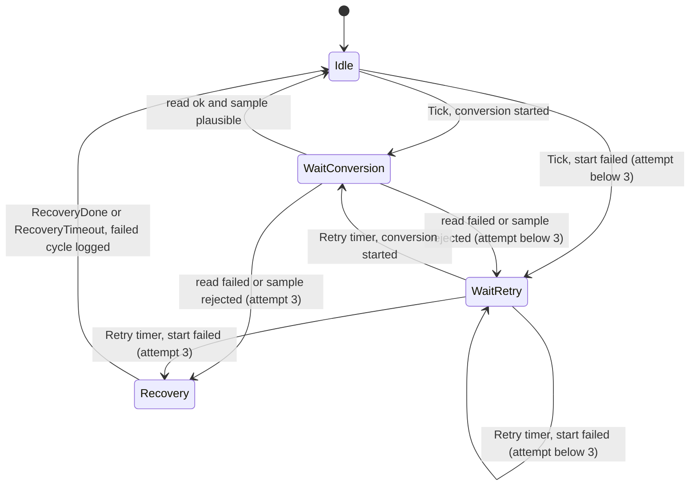
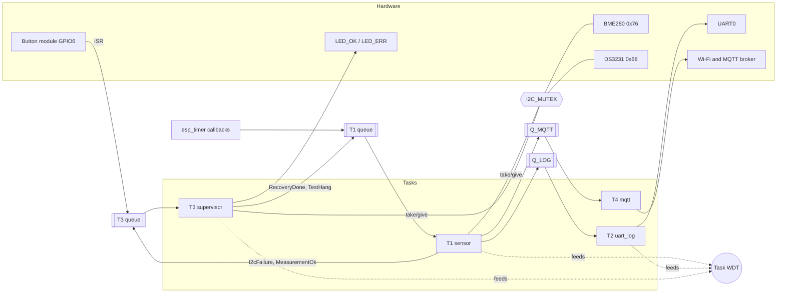
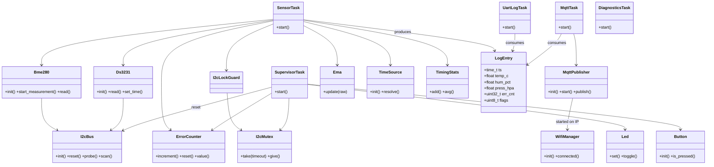
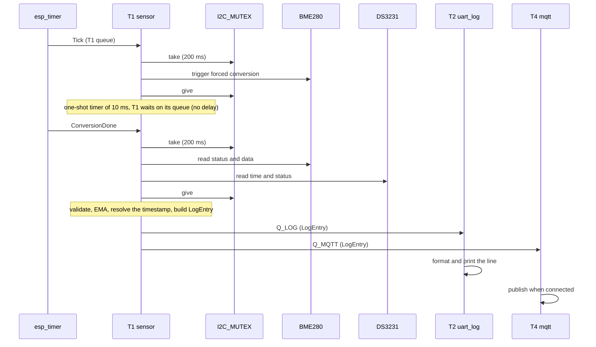
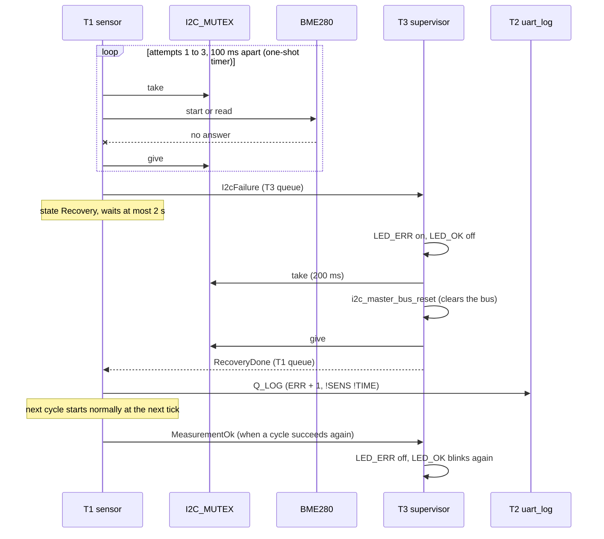
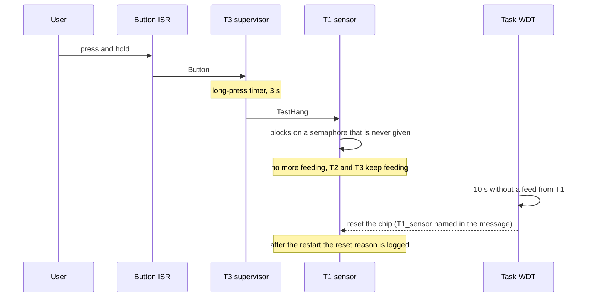

# Architecture

This document describes the firmware as it is implemented. Every constant mentioned here lives in `include/config.h`. Evidence for the behaviour described (logs, measurements) is linked from the sections below and listed in [`logs/`](logs/).

## 1. Layers

| Layer | Responsibility | Contents |
|---|---|---|
| **Periph** | Hardware init and raw access | `I2cBus`, `Bme280`, `Ds3231`, `Led`, `Button`, `WifiManager` |
| **Logic** | Data processing | `SensorTask` (T1), `Ema`, `sensor_validation`, `TimeSource`, `LogEntry`, `format_log_line` |
| **Transport / Output** | Emitting data | `UartLogTask` (T2), `MqttPublisher`, `MqttTask` (T4) |
| **Reliability** | Staying alive | `SupervisorTask` (T3), `I2cMutex`, `ErrorCounter`, `watchdog.h`, `reset_reason`, `DiagnosticsTask`, `TimingStats` |

Source layout mirrors this: `src/periph`, `src/logic`, `src/transport`, `src/reliability`, shared headers in `include/`. All constants (pins, intervals, timeouts, queue lengths, priorities) are in `include/config.h`; shared data types are in `include/data_types.h`. The code is C++; the pure logic that does not need ESP-IDF (`Ema`, `ErrorCounter`, `TimingStats`, `sensor_validation`, `format_log_line`) is unit-tested on the PC (`pio test -e native`, 37 tests).

Dependency rule: upper layers call lower ones, never the reverse. Tasks live in the layer whose responsibility they implement and are created from `app_main`.

## 2. Tasks (one responsibility per Task)

| Task | Layer | Priority | Responsibility |
|---|---|---|---|
| **T3 supervisor** | Reliability | 6 | Bus reset on request, LED_ERR / LED_OK, button gestures, watchdog feed |
| **T1 sensor** | Periph + Logic | 5 | Measurement state machine: timer events, BME280 + DS3231 reads under the I2C mutex, retries, validation, EMA, `LogEntry` fan-out |
| **T2 uart_log** | Transport | 4 | The only writer of log lines: receive `LogEntry`, format, print |
| **T4 mqtt** | Transport | 3 | Publish `LogEntry` to the MQTT broker, best effort |
| diag | Reliability | 1 | Periodic snapshot of heap, CPU load, per-task stack and state (not subscribed to the watchdog) |

The supervisor has the highest priority so that the recovery can always run, even while T1 is busy. T4 has the lowest application priority: it must never compete with the tasks that keep the logger alive.

Why Tasks and not one loop: the processes are independent, have different timing needs, and a blocking call in one (an I2C transfer, a network publish) must put only that Task into the Blocked state, not the whole system.

Why T4 is separate from T2: a network publish has an unpredictable and much longer latency than a UART write. Calling it from T2 would distort the UART log cadence. T4 holds no mutex, never touches I2C, is not subscribed to the watchdog, and is not part of the I2C + WDT reliability guarantees. The system works without Wi-Fi (see [`logs/phase3-mqtt.txt`](logs/phase3-mqtt.txt)).

## 3. Queues and mutex

Rule of thumb: an arrow between two Tasks is a Queue; two code paths reaching one resource need a Mutex.

| Queue | Producers | Consumer | Item | Length | When full |
|---|---|---|---|---|---|
| **T1 queue** | `esp_timer` callbacks (tick, conversion done, retry, recovery timeout), T3 | T1 | `IsrEvent` | 8 | the event is dropped and counted (T1 is never blocked) |
| **T3 queue** | T1, the button ISR, the long-press timer | T3 | `IsrEvent` | 8 | the event is dropped and logged |
| **Q_LOG** | T1 | T2 | `LogEntry` | 8 | the **newest** entry is dropped and counted |
| **Q_MQTT** | T1 | T4 | `LogEntry` | 4 | the **oldest** entry is dropped, so the broker gets the freshest data |

Events carried by the two event queues (`IsrEventType` in `data_types.h`):

| Queue | Event types |
|---|---|
| T1 queue | `Tick`, `ConversionDone`, `Retry`, `RecoveryDone`, `RecoveryTimeout`, `TestHang` |
| T3 queue | `I2cFailure`, `MeasurementOk`, `Button`, `ButtonRelease`, `LongPressTimeout` |

A FreeRTOS queue has one consumer, so T1's fan-out is two sends (Q_LOG and Q_MQTT) with zero timeout. The overflow policy for Q_LOG was verified with a fault-injection test ([`logs/phase6-queue-overflow.txt`](logs/phase6-queue-overflow.txt)).

**One mutex for the whole I2C bus** (`I2cMutex`, created with `xSemaphoreCreateMutex()` for priority inheritance), not one per device: the BME280 and the DS3231 share the bus, and T1 (reads) and T3 (bus reset) both reach it. It is always taken through `I2cLockGuard`, which gives it back on every exit path.

Rules:

- taken with a finite timeout, `I2C_MUTEX_TIMEOUT_MS` = 200 ms; `portMAX_DELAY` is never used on the mutex;
- held only during an I2C transaction, never across a conversion wait, a retry or a recovery;
- a single lock, so there is no lock-ordering problem and no nested locking;
- ISRs use only `...FromISR` APIs (`xQueueSendFromISR`) and never take a mutex.

The shared state and how each part is protected is listed in [`defensive-review.md`](defensive-review.md).

## 4. No `delay()`, and the state machine of T1

Pauses are states exited by an event, not blocking waits: no `delay`, no `vTaskDelay`, no busy-wait in the logic. Every wait is a queue wait with a finite timeout or a one-shot `esp_timer`.

T1 state machine:



- **Idle**: waits for `Tick` (one per `MEASURE_INTERVAL_MS` = 5 s).
- **WaitConversion**: the BME280 forced-mode conversion was started; a one-shot timer of `BME280_CONVERSION_US` = 10 ms posts `ConversionDone`.
- **WaitRetry**: an attempt failed; a one-shot timer of `I2C_RETRY_DELAY_MS` = 100 ms posts `Retry`. At most `I2C_MAX_ATTEMPTS` = 3 attempts per cycle.
- **Recovery**: the three attempts failed. T1 sends `I2cFailure` to T3 and waits for `RecoveryDone`, but not longer than `RECOVERY_TIMEOUT_MS` = 2 s.

A sample counts as an attempt failure in three cases: the I2C transfer fails, the BME280 reports a skipped measurement or a conversion still running, or the compensated values are outside the BME280 operating range (`validate_sample`, see section 6). A cycle that ends in Recovery is not retried again; it is logged as failed (`ERR` + 1, markers `!SENS` and `!TIME`) and the next cycle starts at the next tick. When a later cycle succeeds, T1 sends `MeasurementOk` to T3, which clears the error state.

Bounded retries and bounded waits keep the worst case small: a failed cycle takes about 220 ms and never blocks the UART log ([`logs/phase4-i2c-recovery.txt`](logs/phase4-i2c-recovery.txt)).

## 5. Supervisor, LEDs and the button (T3)

T3 reacts to events and also runs its own heartbeat: its queue wait times out every `SUPERVISOR_TICK_MS` = 500 ms, which toggles LED_OK (a 1 Hz blink shows that T3 is alive) and feeds the watchdog.

| Event or state | What T3 does |
|---|---|
| `I2cFailure` from T1 | LED_ERR on, LED_OK off; takes the I2C mutex (200 ms), calls `I2cBus::reset()`, answers `RecoveryDone` with the result, also when the reset failed |
| `MeasurementOk` from T1 | the sensor is back: LED_ERR off, LED_OK blinks again |
| short button press | clears the error counter (`ERR` in the log goes back to 0) |
| long button press (3 s) | watchdog demonstration: sends `TestHang` to T1, which blocks on purpose |

`I2cBus::reset()` calls `i2c_master_bus_reset()`. In ESP-IDF 5.5.3 this resets the I2C hardware state machine **and** clears the bus (SCL pulses until a slave releases SDA), and the device handles stay valid, so recreating the bus is not needed.

The button is a 3-pin module with an on-board pull-down: low at rest, high when pressed (`BUTTON_PRESSED_LEVEL` = 1). An any-edge ISR applies a quiet-time debounce (an edge counts only after `BUTTON_DEBOUNCE_US` = 50 ms without any edge) and posts `Button` or `ButtonRelease` to the T3 queue. A press starts a one-shot long-press timer (`BUTTON_LONG_PRESS_MS` = 3000 ms); a release before it expires is a short press, and the timer handler checks the pin level too, because a tap shorter than the debounce time loses its release event ([`logs/phase4-button.txt`](logs/phase4-button.txt)).

## 6. Watchdog

| Item | Value |
|---|---|
| Timeout | 10 s, `CONFIG_ESP_TASK_WDT_PANIC=y` (a timeout resets the chip) |
| Measurement interval | 5 s (independent of the timeout) |
| Subscribed tasks | T1, T2, T3 |
| Not subscribed | T4 (network), diag, the idle tasks |
| Feed | at the top of every loop iteration of each subscribed task, i.e. after each queue wait (1 s for T1 and T2, 0.5 s for T3) |

The course documents set both the timeout and the interval to 5 s, which would reset the system on a normal cycle. Here the feed is decoupled from the measurement interval, and the timeout is far longer than the longest legal pause: the worst case between two feeds of T1 is about 1.6 s (see [`defensive-review.md`](defensive-review.md)). A task that blocks anywhere else stops feeding, and the watchdog names it and resets the chip within 10 s ([`logs/phase4-wdt.txt`](logs/phase4-wdt.txt)).

At boot `esp_reset_reason()` is logged first; a watchdog reset is logged as an error; a panic, brownout or CPU lockup reset is logged as a warning; any other reason is logged as info. So a previous hang is visible after the restart.

## 7. Data structures, time and log format

```c
struct LogEntry {
    time_t   ts;         // from the DS3231 when valid, else the internal clock
    float    temp_c;     // EMA-filtered
    float    hum_pct;    // EMA-filtered
    float    press_hpa;  // EMA-filtered
    uint32_t err_cnt;    // failed measurement cycles, saturating
    uint8_t  flags;      // LOG_FLAG_SENSOR_VALID, LOG_FLAG_TIME_TRUSTED
};
```

Log line: `[HH:MM:SS] T:23.4 H:48% P:1013 ERR:0`, with two markers when needed: ` !TIME` (the timestamp does not come from a valid RTC) and ` !SENS` (the sensor values are not from a successful read). The `LUX` field of the assignment brief is absent because the photoresistor was dropped (see [`decisions.md`](decisions.md)).

**EMA filter:** `filtered = alpha * raw + (1 - alpha) * filtered`, `alpha` = 0.2. The choice is justified with real data in [`ema-experiment.md`](ema-experiment.md). The filter only receives samples that passed the plausibility check.

**Validation:** a sample is rejected, and counted as a failed attempt, when a value is not finite or outside the BME280 operating range (-40...85 C, 0...100 %RH, 300...1100 hPa).

**Time:** `TimeSource` synchronises the system clock from the DS3231 at boot. For every entry T1 reads the DS3231 under the same mutex as the BME280; a valid reading (oscillator-stop flag clear, date not the default 2000-01-01, fields in range) gives the timestamp. Otherwise the internal clock is used and the entry is marked `!TIME` ([`logs/phase3-rtc.txt`](logs/phase3-rtc.txt)).

**Error counter:** `ErrorCounter` is atomic and saturating (it stops at its maximum instead of wrapping to 0). T1 increments it once per failed cycle; a short button press resets it.

## 8. MQTT telemetry (T4)

- Topics: `envlogger/ykazan/temp`, `/hum`, `/pres` (only when the sensor data is valid, so stale values are never published as fresh) and `/err` (always); public broker `broker.hivemq.com`, QoS 0, no retain.
- A public broker means anyone can read or write the topics. Room climate data is harmless and the prefix is a uniqueness aid, not protection. This is a known limitation, listed in the README.
- T4 never blocks anything: when the broker is not connected the entries are dropped.
- Wi-Fi: `WifiManager` retries immediately 5 times after a drop, then once every 30 s (one-shot timer), without a limit, so the logger reconnects when the access point returns. The ESP32-S3 supports 2.4 GHz networks only. Credentials and the broker URI are in git-ignored `include/secrets.h` (template: `secrets.h.example`).
- Evidence: values received by an independent client, and a router outage during which the UART log kept its 5 s cadence ([`logs/phase3-mqtt.txt`](logs/phase3-mqtt.txt)).

## 9. Boot sequence

`app_main` runs, in this order: log the reset reason; create the I2C bus and scan it; initialise the BME280 and DS3231 and read the RTC state; synchronise the clock (`TimeSource`); create the mutex, the queues, the LEDs; start T2, then T1 (which creates its queue and timers), then T3 (given T1's queue), then attach the button ISR to the T3 queue; start the diagnostics task; last, best effort, NVS, Wi-Fi and MQTT. If the network part fails, the UART log keeps running.

## 10. Block diagram



## 11. UML

### Class view



### Sequence 1: normal measurement cycle



### Sequence 2: I2C failure and recovery



### Sequence 3: watchdog demonstration (long button press)



## 12. Resolved questions and known limitations

Questions that were open during the design and are now answered:

- BME280 conversion time: 9.3 ms worst case for oversampling x1 (datasheet), 10 ms used.
- Is `i2c_master_bus_reset()` enough for a stuck bus? Yes, it also clears the bus (SCL pulses) and keeps the device handles valid.
- The schematic is in `hardware/kicad/` and exported to `schematic/`.

Known limitations are listed in [`defensive-review.md`](defensive-review.md) (section 6) and in the README.
