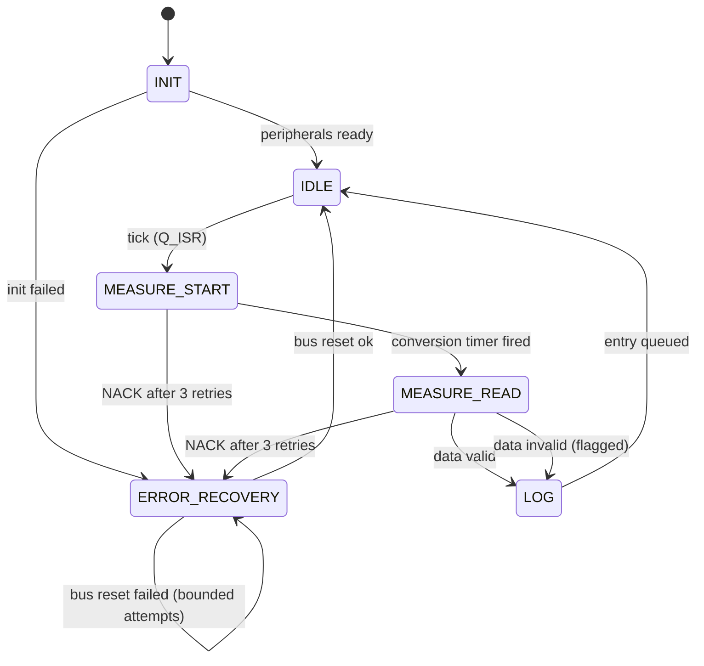
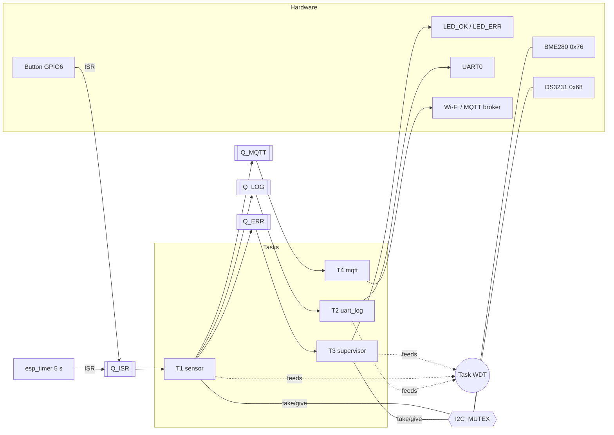
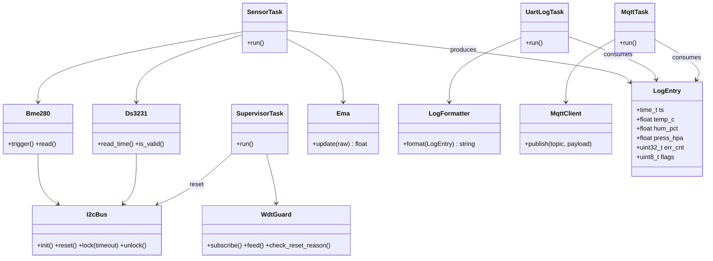
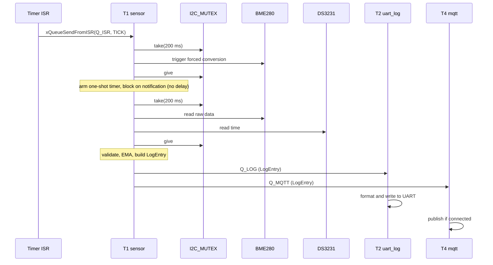
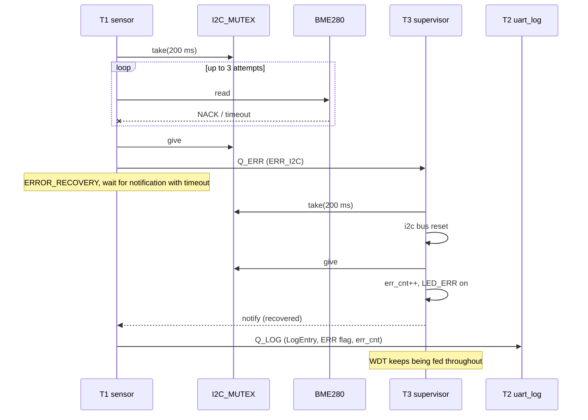

# Architecture

Design is done on paper first; no firmware beyond the skeleton exists yet. Values marked *(proposed)* are initial choices to be validated during implementation.

## 1. Layers

| Layer | Responsibility | Contents |
|---|---|---|
| **Periph** | Hardware init and raw access | I2C bus, BME280 and DS3231 drivers, UART, GPIO, timer, Wi-Fi |
| **Logic** | Data processing | `LogEntry`, EMA filter, validation, timestamp check, log formatting |
| **Transport / Output** | Emitting data | UART log writer, MQTT publisher |
| **Reliability** | Staying alive | Task WDT, retry and I2C bus reset, I2C mutex, reset-reason check |

Source layout mirrors this: `src/periph`, `src/logic`, `src/transport`, `src/reliability`; shared `include/config.h` (all constants, no magic numbers) and `include/data_types.h`.

Dependency rule: upper layers call lower ones, never the reverse. Tasks live in the layer whose responsibility they implement and are created from `app_main`.

## 2. Tasks (one responsibility per Task)

| Task | Layer | Responsibility |
|---|---|---|
| **T1 sensor** | Periph + Logic | Timer event → read BME280 and DS3231 under the I2C mutex → validate → EMA → build `LogEntry` → fan out to Q_LOG and Q_MQTT |
| **T2 uart_log** | Transport | Receive `LogEntry` from Q_LOG, format, write to UART |
| **T3 supervisor** | Reliability | Receive error events from Q_ERR, reset the I2C bus, drive LEDs and `err_cnt`, feed the WDT |
| **T4 mqtt** | Transport | Receive `LogEntry` from Q_MQTT, publish over Wi-Fi/MQTT, best effort |

Why Tasks and not one loop: the processes are independent, have different timing needs, and a blocking call in one (I2C transfer, network publish) must put only that Task into Blocked state, not the whole system.

Why T4 is separate from T2: a network publish has an unpredictable and much longer latency than a UART write. Calling it from T2 would distort the UART log cadence. T4 holds no mutex, never touches I2C, and is not part of the I2C+WDT reliability guarantees. The system must demo fine without Wi-Fi.

## 3. Queues and mutex

Rule of thumb: an arrow between two Tasks is a Queue; two code paths reaching one resource need a Mutex.

| Object | Type | From → To | Item | Length *(proposed)* |
|---|---|---|---|---|
| Q_LOG | Queue | T1 → T2 | `LogEntry` | 8 |
| Q_MQTT | Queue | T1 → T4 | `LogEntry` | 4 (drop oldest when full) |
| Q_ERR | Queue | T1 → T3 | `ErrEvent` | 8 |
| Q_ISR | Queue | timer / button ISR → T1 | `IsrEvent` | 8 |
| I2C_MUTEX | Mutex (`xSemaphoreCreateMutex`) | T1, T3 | — | — |

A FreeRTOS queue has one consumer, so T1 fan-out is two sends (Q_LOG, Q_MQTT) with zero timeout; a full queue increments a drop counter instead of blocking T1.

**One mutex for the whole I2C bus**, not one per device: BME280 and DS3231 share the bus, and T1 (reads) and T3 (bus reset) both reach it. It is a mutex, not a binary semaphore, for priority inheritance.

Rules:
- Take with a finite timeout, `pdMS_TO_TICKS(200)`; `portMAX_DELAY` only for a Task that does not feed the WDT, with a justification comment.
- Always give on every exit path, including errors.
- Hold only during the I2C transaction, never across a conversion wait.
- Lock order is fixed: I2C_MUTEX first, nothing else is ever taken while holding it.
- ISRs use only `...FromISR` APIs; ISR-shared variables are `volatile`.

## 4. No `delay()` and the FSM

Pauses are states exited by an event, not blocking waits: no `delay`, no `vTaskDelay`, no busy-wait. Tasks block on a Queue or Task Notification with a finite timeout.

T1 state machine:



- `MEASURE_START`: trigger BME280 forced-mode conversion, arm a one-shot timer for the conversion time.
- `MEASURE_READ`: read BME280 and DS3231, validate, apply EMA.
- `ERROR_RECOVERY`: post `ErrEvent` to T3, wait for its completion notification with a timeout. After a bounded number of failed attempts the entry is logged with an error flag; the system keeps running and the WDT is not starved.

## 5. Watchdog

| Item | Value *(proposed)* |
|---|---|
| WDT timeout | 10 s |
| Measurement interval | 5 s |
| Feed period | 1 s, from a timed wait in each subscribed Task |
| Subscribed Tasks | T1, T2, T3 |

The course documents set both timeout and interval to 5 s, which would reset the system on a normal cycle. Here the feed is decoupled from the measurement interval: every subscribed Task wakes at least once per second on a timeout and feeds. A hung Task stops feeding and the WDT fires within 10 s.

On boot, `esp_reset_reason() == ESP_RST_TASK_WDT` is logged and counted, so a prior hang or deadlock is visible.

## 6. Data structures and log format

```c
typedef struct {
    time_t   ts;        // from DS3231, validated
    float    temp_c;    // EMA-filtered
    float    hum_pct;   // EMA-filtered
    float    press_hpa; // EMA-filtered
    uint32_t err_cnt;   // cumulative I2C errors
    uint8_t  flags;     // bit0: sensor valid, bit1: RTC valid
} LogEntry;
```

Log line: `[HH:MM:SS] T:23.4 H:48% P:1013 ERR:0`

The `LUX` field from the assignment brief is intentionally absent because the photoresistor was dropped (see [decisions](decisions.md)).

EMA filter: `filtered = alpha * raw + (1 - alpha) * filtered`, `alpha = 0.2` *(proposed)*. At a 5 s interval this gives a time constant of about 4 samples (20 s): it suppresses sensor noise while still following real room changes within a minute.

All constants (interval, alpha, timeouts, pins, thresholds, queue lengths) live in `include/config.h`.

## 7. MQTT telemetry

- Topics: `envlogger/<student>/{temp,hum,pres,err}`; public broker `broker.hivemq.com`, QoS 0, no retain.
- A public broker means anyone can read or write the topics. Room climate data is harmless, and the student prefix is a uniqueness aid, not protection. Documented as a known limitation in the README.
- T4 is non-blocking: if not connected, `mqtt_publish()` returns immediately. UART is the source of truth.
- Wi-Fi credentials live in git-ignored `include/secrets.h` (template: `secrets.h.example`).

## 8. Block diagram



## 9. UML

### Component / class view



### Sequence 1: normal measurement cycle



### Sequence 2: I2C bus error and recovery



## 10. Open items

- Verify BME280 conversion time for the chosen oversampling and set the one-shot timer accordingly.
- Confirm that `i2c_master_bus_reset()` is sufficient for a stuck-SDA condition, or add manual SCL clocking.
- Draw the KiCad/draw.io schematic into `docs/schematic/`.
