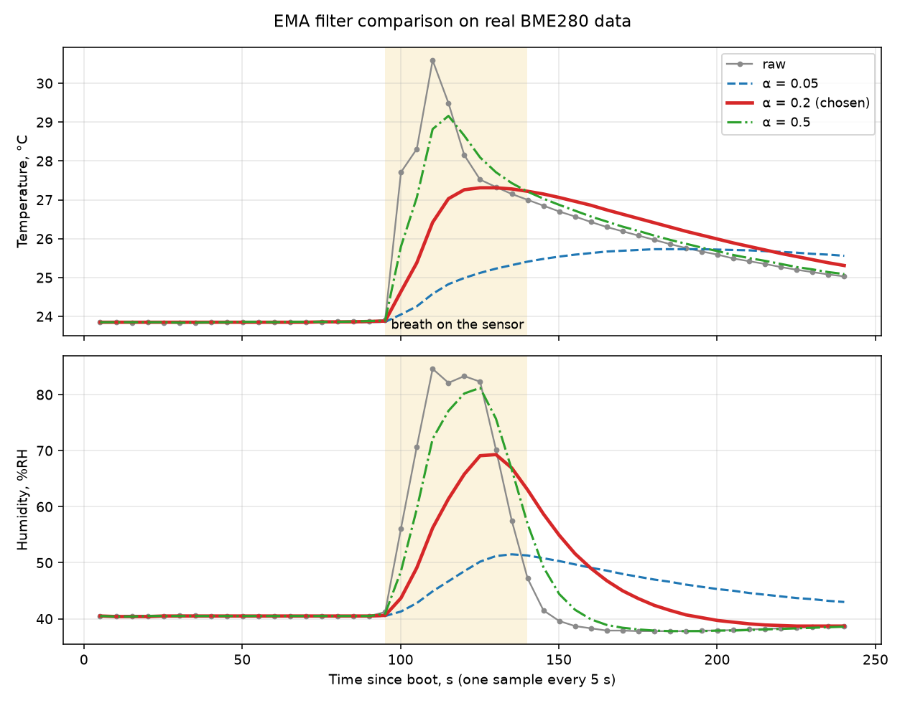

# EMA filter: why alpha = 0.2

The measurements are smoothed with an exponential moving average,
`filtered = alpha * raw + (1 - alpha) * filtered`, sampled every 5 s (`include/ema.h`, tested on the PC in `test/test_ema`).

## Time constant

For a sample period T the time constant is `tau = -T / ln(1 - alpha)`.

| alpha | tau at T = 5 s | meaning |
|---|---|---|
| 0.05 | 97 s | very slow |
| 0.2 | 22 s | follows a real change in about a minute |
| 0.5 | 7 s | almost no smoothing |

## Experiment

Real BME280 data, one sample every 5 s, all three filters fed with the same raw samples
(`EMA_EXPERIMENT_LOG = true` in `include/config.h` prints the CSV lines).
Data: [`data/ema_experiment.csv`](data/ema_experiment.csv). Plot script: `tools/plot_ema.py`.

The room was left alone for about 90 s, then a breath was directed at the sensor for roughly 45 s (a short, strong disturbance), then the sensor was left to recover.

| | raw | alpha 0.05 | alpha 0.2 | alpha 0.5 |
|---|---|---|---|---|
| Temperature rise at the peak (baseline 23.9 C) | +6.7 C | +1.9 C (28 %) | +3.5 C (51 %) | +5.3 C (79 %) |
| Humidity rise at the peak (baseline 40.5 %RH) | +44.1 | +11.0 (25 %) | +28.8 (65 %) | +40.7 (92 %) |
| Temperature 130 s after the raw peak (raw 25.03 C) | 25.03 | 25.56 (+0.53) | 25.31 (+0.28) | 25.09 (+0.06) |
| Humidity 130 s after the raw peak (raw 38.7 %RH) | 38.7 | 43.0 (+4.3) | 38.7 (+0.0) | 38.6 (-0.1) |

## What the data shows

- **alpha = 0.5** reproduces 80-90 % of a short disturbance. It filters very little: a one-off outlier passes with 50 % of its size.
- **alpha = 0.05** reacts to only about a quarter of the disturbance and, more than two minutes later, still reports a humidity 4.3 %RH above the real value. For a logger it would publish stale numbers.
- **alpha = 0.2** is the compromise: it attenuates a short disturbance to roughly half or two thirds, is back on the raw value for humidity within about 100 s after the disturbance, and passes a single outlier with only 20 % of its size.

## Limits of this experiment

- In this room the sensor noise is tiny (raw temperature varies by about 0.04 C and humidity by 0.2 %RH while nothing happens), so noise suppression does not distinguish the alphas. The filter's practical value here is rejecting short disturbances and single bad samples.
- One run with a breath is not a standardised test, and the numbers will differ between runs.
- alpha is a trade-off between smoothing and lag, not a uniquely correct value: another application could reasonably choose 0.1 or 0.3. 0.2 is chosen because the lag of about a minute is acceptable for an environment logger with a 5 s period.
