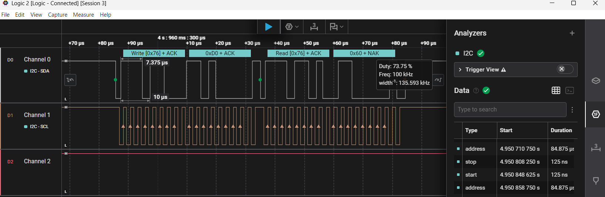
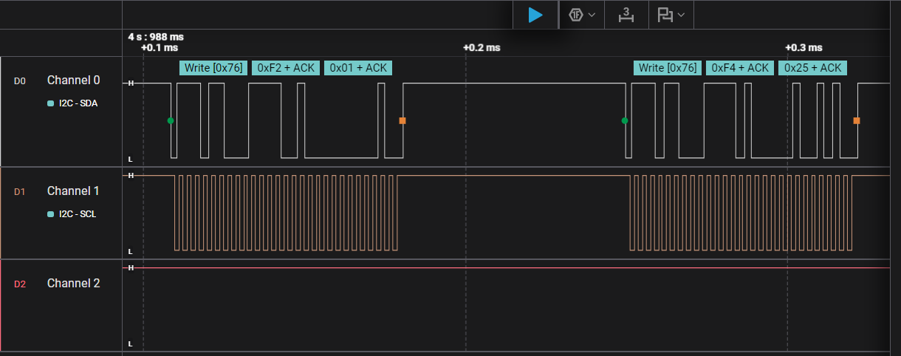
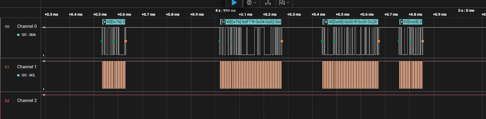
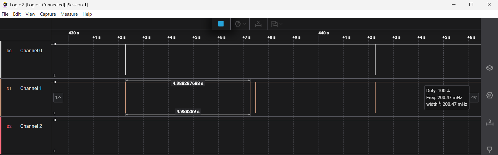

# Logic analyzer captures

Captured with an 8-channel 24 MHz logic analyzer (a "Saleae clone") and Saleae Logic 2 with its I2C analyzer. Connections: Channel 0 to SDA (GPIO8), Channel 1 to SCL (GPIO9), GND to GND; Channel 2 is not connected. Raw exports of the decoded bus traffic are in [`img/logic-analyzer/`](img/logic-analyzer/) (`boot.csv`, `measurement.csv`, `nack-recovery.csv`); the numbers below come from `tools/analyze_i2c.py` run on those files.

## 1. Board start: address scan and BME280 initialisation

The screenshot shows the BME280 chip ID read during initialisation, decoded by the analyzer: `Write [0x76] + ACK`, register `0xD0 + ACK`, `Read [0x76] + ACK`, data `0x60 + NAK` (the NAK after the last byte is how a master ends a read). `0x60` is the BME280 chip ID. The SCL pulses in this zoom are about 2.5 us apart, which is 400 kHz.

The address scan is quantified from `boot.csv`:

| Quantity | Value |
|---|---|
| Probed addresses | 112 (`0x08` to `0x77`), one address byte each |
| Answered with ACK | 3: `0x50` (EEPROM on the DS3231 module), `0x68` (DS3231), `0x76` (BME280) |
| Answered with NACK | 109 |
| Address byte duration | 84.9 us (the IDF probe always runs at 100 kHz) |
| Whole scan | 16.6 ms |

After the scan the firmware works at 400 kHz: the address byte of those transfers lasts 21.1 us, which is 4.02 times shorter than a probe, i.e. 400 kHz against 100 kHz. The initialisation then reads the chip ID (`0x60`), the 26 + 7 bytes of calibration data and writes `0xF5 = 0x00` and `0xF2 = 0x01`.

## 2. One measurement cycle

The first screenshot shows the two writes that start a forced-mode conversion: `0xF2 = 0x01` (humidity oversampling x1) and `0xF4 = 0x25` (temperature and pressure x1, forced mode). The second shows the reads about 10 ms later: the BME280 status (`0xF3`), its 8 data bytes (`0xF7`...), the DS3231 time registers (7 bytes from `0x00`) and its status register (`0x0F`).

From `measurement.csv` (three consecutive cycles):

| Step | Bus time | Gap before it |
|---|---|---|
| Write `0xF2 0x01` to `0x76` | 72 us | |
| Write `0xF4 0x25` to `0x76` | 72 us | 69 us |
| Read BME280 status (1 byte) | 49 us | **10.26 ms** (the conversion wait) |
| Read BME280 data (8 bytes) | 207 us | 0.15 ms |
| Read DS3231 time (7 bytes) | 184 us | 0.21 ms |
| Read DS3231 status (1 byte) | 49 us | 0.13 ms |

- The cycles start 4.99974 s apart: the three bursts start at 4.988108 s, 9.987845 s and 14.987587 s on the analyzer clock, i.e. every 5 s as configured. The idle gap between the end of one burst and the start of the next is about 4.988 s (not the same quantity), because a burst itself lasts about 11.7 ms.
- The wait between the conversion start and the read is 10.26 ms: the 10 ms one-shot timer plus 0.26 ms of task latency. Nothing blocks during it.
- Data on the wire: 0.63 ms of actual transfers per cycle (0.013 % of the 5 s). The firmware measured 534 us for "start" and 1230 us for "read" ([`measurements.md`](measurements.md)); the wire time is only 144 us for the "start" writes (two writes, 72 us each) and 489 us for the four reads (49 + 207 + 184 + 49 us); the rest of the firmware figures, together with the gaps between the transfers, is driver and mutex overhead, and the read phase of 1.27 ms from the first read START to the last STOP matches the firmware figure.
- The DS3231 bytes decode to a valid time. In `measurement.csv` the seconds register reads `0x30`, `0x35`, `0x40` in the three cycles (23:28:30, 23:28:35, 23:28:40 on 05.10.2026), exactly 5 s apart. (The first read in `boot.csv`, `0x40 0x33 0x23 0x01 0x05 0x10 0x26`, is 23:33:40 on the same date.) The status register bit 7 (oscillator-stop flag) is 0.

## 3. SDA disconnected: failed attempts

The SDA wire between the board and the modules was disconnected while the firmware was running; the analyzer's SDA probe stayed on the module side of the cut, so it sees SCL (driven by the board) but SDA never leaves the high level. With nothing pulling SDA low the decoder reads every frame as `0xFF + NAK`: no address is ever acknowledged. In `nack-recovery.csv`:

- the normal cycles at 2.547 s and 7.547 s decode as in section 2;
- the cycle at 12.547 s fails: three attempts at 12.547 s, 12.655 s and 12.762 s, **107.5 ms apart** (the 100 ms retry timer plus about 7.5 ms for the failing transfer), exactly the three attempts of the retry policy (`I2C_MAX_ATTEMPTS` = 3, `I2C_RETRY_DELAY_MS` = 100);
- the cycle at 17.547 s fails as well: the cycles at 12.5 s and 17.5 s are the two that are missing before the next valid one at 22.546 s, so the wire was out for two cycles;
- normal decoded traffic returns at 22.546 s.

The firmware log of a similar test ([`logs/phase4-i2c-recovery.txt`](logs/phase4-i2c-recovery.txt)) shows the same 3 attempts, the bus reset and the recovery.

In the screenshot a further short mark on SCL follows the third attempt after about 20 ms. That fits the clock pulses of the bus reset (`i2c_master_bus_reset()` clears a stuck bus with SCL pulses), but the decoder merges it into the last `0xFF + NAK` frame, so the capture does not let me confirm it pulse by pulse. The second failing cycle also shows one additional short frame about 4 ms before its first attempt that I cannot attribute to a specific firmware action.

## What this proves, and what it does not

It proves, on the real bus: the START / address / ACK / data / STOP structure of the traffic, NACK for the 109 unused addresses and ACK for the three devices, 400 kHz transfers, the 5 s cycle with the 10 ms conversion wait, and the retry spacing when the bus is broken. It does not show the individual SCL pulses of the bus reset.
