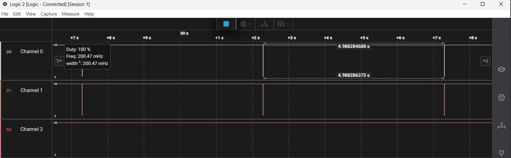

# Logic analyzer captures

Captured with an 8-channel 24 MHz logic analyzer (a "Saleae clone") and Saleae Logic 2. Connections: Channel 0 to SDA (GPIO8), Channel 1 to SCL (GPIO9), GND to GND. Channel 2 is not connected.

These captures show the **timing structure** of the I2C traffic: bursts, their spacing and the retry pattern. They were taken zoomed out, without the I2C protocol decoder, so individual bytes, addresses and ACK/NACK bits are **not** visible in them. The protocol level (addresses, register reads, `NACK` versus `ACK`) is documented from the firmware logs instead ([`logs/phase2-bringup.txt`](logs/phase2-bringup.txt), [`logs/phase4-i2c-recovery.txt`](logs/phase4-i2c-recovery.txt)).

## 1. Board start: address scan and device initialisation

After reset the firmware probes every address from `0x08` to `0x77` at 100 kHz and then initialises the BME280 and the DS3231 at 400 kHz. In the capture this is a dense burst of activity on both lines that lasts about 25 ms, followed by shorter, sparser transactions. Both lines are active together, as expected for I2C.

## 2. Regular measurement cycle

One burst of I2C traffic per measurement. The analyzer measures 4.988 s between two consecutive cycles. The firmware interval is 5 s: the UART log shows 5.00 s +/- 7 ms between lines (see [`logs/phase3-pipeline.txt`](logs/phase3-pipeline.txt)), and the ESP32 timer is driven by a crystal, so the 0.24 % difference is most likely the time base of the low-cost analyzer, not the firmware. This is an interpretation, not a measurement of the analyzer's clock.

Between two cycles the bus is idle: the I2C phases of a cycle take about 1.8 ms of the 5 s (see [`measurements.md`](measurements.md)).

## 3. SDA disconnected: three attempts, then recovery

The SDA wire between the board and the modules was disconnected while the firmware was running. In the failing cycle there is activity on SCL only (Channel 1), as a group of three thin marks about 100 ms apart: the three attempts of the retry policy (`I2C_MAX_ATTEMPTS` = 3, `I2C_RETRY_DELAY_MS` = 100 ms), with no answer on SDA. The cycles on both sides of the failure show normal activity on both channels, so the system carried on and recovered by itself.

The bus reset that follows the third attempt (a series of SCL pulses that releases a stuck SDA) happens within a few milliseconds of it, so it cannot be told apart from the third attempt at this time scale.

## What is still missing

Zoomed-in captures with the I2C decoder (START, address, ACK or NACK, data, STOP) of one scan probe and of one measurement cycle. They can be added to this document when the decoder can be used with this analyzer.
